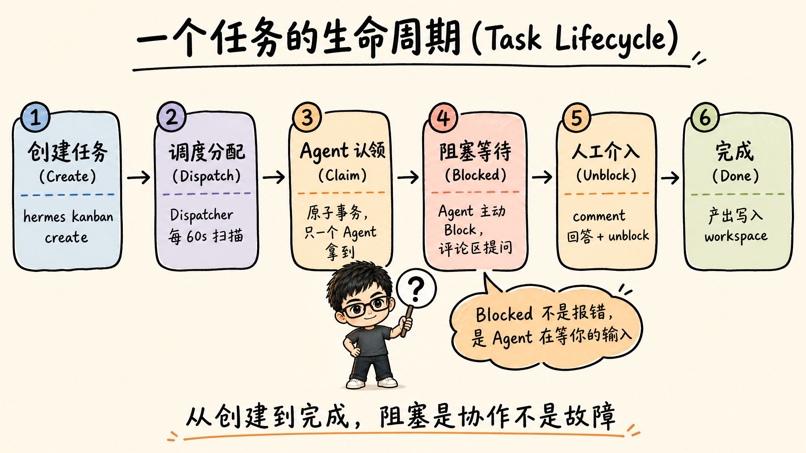
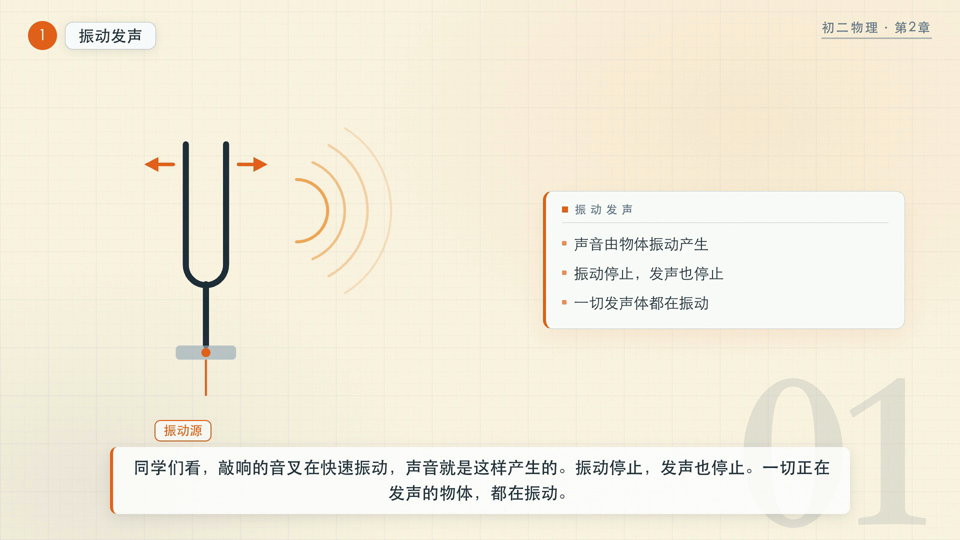
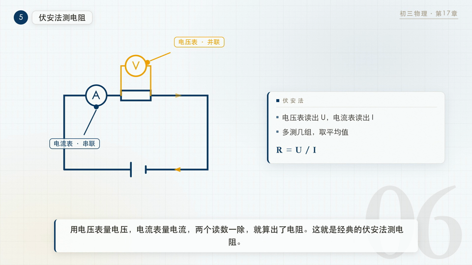
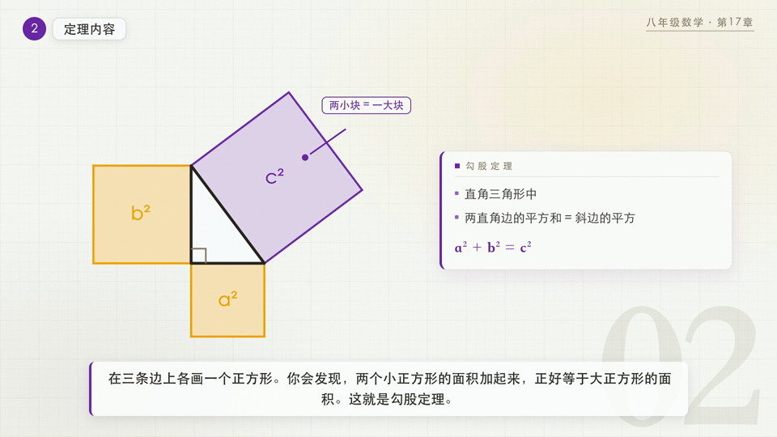
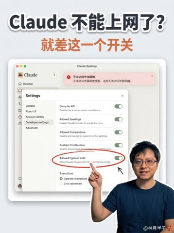

# 林月半子 · AI 配图技能库

公众号「林月半子的 AI 笔记」的 Claude Code 配图技能集合。自动为技术长文生成概念图、流程图、对比图、架构图，为学科知识点生成信息图、教学动图和带配音的教学视频。

## Preview Gallery

`linyuebanzi-inline-diagram` 支持 7 种视觉风格：

| | | | |
|:---:|:---:|:---:|:---:|
|  |  |  |  |
| notebook · 手绘网格笔记本风 | infographic · 专业扁平信息图 | executive-tech · 现代科技商务风 | cozy-handdrawn · 温暖手绘卡片风 |
|  |  |  | |
| tech-doodle · 技术简笔画风 | cartoon-infographic · 卡通信息图风 | whiteboard-sketch · 白板手绘风 | |

## 包含 Skills

### `linyuebanzi-inline-diagram` · 技术长文插图生成

为 3000~8000 字技术长文自动识别插图位置，生成 4-5 张概念图、流程图、对比图、架构图。支持 notebook / infographic / executive-tech / cozy-handdrawn / tech-doodle / cartoon-infographic / whiteboard-sketch 七种视觉风格。

- **输入**: 技术长文 Markdown
- **输出**: 多张 16:9 插图 PNG + 插入位置清单

### `linyuebanzi-edu-infographic` · 学科知识信息图生成

将任意学科知识点转化为竖版教育信息图（9:16）。输入一个知识点名称（如「声现象」「勾股定理」「光合作用」），自动识别学科/年级/章节、拆解核心子概念、生成插图描述并生图。内置**双层学科准确性检查**：生图前按分学科清单自检提示词，生图后读回 PNG 视觉复核（文字/公式/图示），不通过自动重试，确保交付给学生的内容准确。覆盖物理、数学、化学、生物、语文、历史、英语等学科。

- **输入**: 知识点名称（可含学科/年级）
- **输出**: 9:16 竖版信息图 PNG

不同学科示例（初中）：

| | | | |
|:---:|:---:|:---:|:---:|
|  |  |  |  |
| 物理 · 光现象 | 数学 · 勾股定理 | 化学 · 空气的组成 | 生物 · 光合作用 |

### `linyuebanzi-teaching-animation` · 教学动图 + 配音教学视频

`linyuebanzi-edu-infographic` 的动态版。输入一个学科概念（如「声现象」「欧姆定律」「勾股定理」），两种动态产出（都由 HyperFrames 渲染，共用同一个 `index.html`，靠 `mode` 变量切换）：

| 产出 | 规格 | 用途 |
|---|---|---|
| **配音视频** | 1080p、~90s、中文旁白 + 字幕 | 完整讲解，发视频号 / 给孩子看 |
| **无声动图** | 1080p、~32s、无声、循环 | 公众号正文内嵌自动播放 |

两种产出共用一份 7 段分镜（1 标题 + 5 子概念 + 1 总结）和同一套主题配色，视频和动图风格完全统一。配色按学科主题自动匹配（声/光/力/电/热/生物/数学 7 套，60-30-10 分层 + 冷暖对比），标题公式用宋体、正文用黑体，自带纸张颗粒质感和波形流动等物理正确的持续动效。无声动图是视频画面的紧凑循环版，1080p 完整只有 8~10MB，比 GIF 清晰得多。

- **输入**: 学科概念名称（可含学段，默认初二）
- **输出**: 配音视频 MP4 + 无声循环 MP4 + 7 场景蒙太奇预览

不同主题示例：

| | | |
|:---:|:---:|:---:|
|  |  |  |
| 物理 · 声现象（暖橙） | 物理 · 欧姆定律（深蓝） | 数学 · 勾股定理（紫） |

https://github.com/user-attachments/assets/8c5b6a7c-3aa7-4e99-b99f-661c999c27cd


### `linyuebanzi-video-cover-generator` · 短视频封面生成

根据视频口播文案,为视频号/抖音/小红书短视频生成 3:4 竖版封面图。以 LQ 头像为参考图保持人物一致性,内置 11 种可选视觉风格(默认深色科技标题风),自动提炼"人话"主标题、构建"问题 → 解决"UI 叙事,生成后读图自检(标题逐字核对/表情/水印/层级)。

- **输入**: 视频口播文案(可指定风格)
- **输出**: 3:4 竖版封面 PNG(1080×1440)

11 种风格(同一主题实测):

| | | |
|:---:|:---:|:---:|
|  |  |  |
| 1 深色科技标题风 · 默认安全牌 | 2 明亮 YouTuber 风 · 科普/破圈 | 3 双屏对比叙事风 · 避坑/报错修复 |
|  |  |  |
| 4 产品主视觉风 · 工具测评 | 5 拼贴信息飓风 · 工作流/多工具 | 6 工作台场景风 · Vlog 式教程 |
|  |  |  |
| 7 故障警示风 · Bug 排查/安全提醒 | 8 Agent 号召风 · AI 工具推荐 | 9 卡片展示人设风 · 工具合集 |
|  |  | |
| 10 萌宠代码风 · 轻松入门 | 11 手持设备展示风 · 网页/App 展示 | |

### `linyuebanzi-image-gen` · 通用图像生成

支持三种生图 API 的执行层，通过 `--provider` 切换：

| Provider | 参数 | 环境变量 | 模型 |
|---|---|---|---|
| MuleRun | `--provider mulerun`（默认） | `MULERUN_API_KEY` | Nano Banana 2 |
| APImart | `--provider apimart` | `APIMART_API_KEY` | GPT Image 2 |
| Atlas Cloud | `--provider atlascloud` | `ATLASCLOUD_API_KEY` | GPT Image 2 |

支持纯文本生图（generation）和带参考图修图（edit）两种模式，单张和批量执行。被其他 skill 调用的基础设施，不直接面向终端用户。

## 安装

```bash
# 安装全部 skills（推荐）
npx skills add lqshow/linyuebanzi-skills

# 全局安装（所有项目可用）
npx skills add lqshow/linyuebanzi-skills -g

# 只安装某一个 skill
npx skills add lqshow/linyuebanzi-skills -s linyuebanzi-inline-diagram

# 先看看有哪些可安装的
npx skills add lqshow/linyuebanzi-skills --list
```

## 使用

安装后在 Claude Code 中直接对话触发：

```bash
# 插图生成（会先让你选风格）
"帮这篇文章加几张插图，用笔记本手绘风"
"这篇太单调了，配几张图"

# 指定风格
"用温暖手绘卡片风配图"
"来张专业信息图风格的"

# 教学动图 / 视频
"做一个声现象的教学动图"          # → GIF + MP4
"做一个勾股定理的教学视频"        # → 带配音的完整视频
"光合作用，动图和视频都要"

# 短视频封面（会先让你选风格，默认深色科技标题风）
"给这个视频做个封面"
"用萌宠代码风来一张抖音封面"
```

需要设置对应的环境变量：

- 图片类 skill：`MULERUN_API_KEY`、`APIMART_API_KEY` 或 `ATLASCLOUD_API_KEY`（只设一个就会自动检测）
- 教学视频配音：`MINIMAX_API_KEY`（Minimax T2A v2，部分账号还需 `MINIMAX_GROUP_ID`）

教学视频/动图的本地依赖：Node.js ≥22 + ffmpeg（HyperFrames 通过 `npx` 自动获取）。

## 项目结构

```
linyuebanzi-skills/
├── README.md
├── previews/                                # 预览图
├── skills/
│   ├── linyuebanzi-inline-diagram/          # 插图生成 skill
│   │   ├── SKILL.md                         # 入口定义
│   │   ├── scripts/
│   │   │   └── inject_style.py              # 风格注入脚本
│   │   └── references/                      # 提示词模板、风格定义、案例
│   │       ├── styles/                      # 7 种风格定义
│   │       ├── examples.md                  # 完整案例
│   │       └── prompt_template.md           # 骨架模板
│   ├── linyuebanzi-edu-infographic/         # 学科知识信息图 skill
│   │   ├── SKILL.md                         # 入口定义
│   │   └── references/                      # 提示词模板、插图指引、准确性清单、勘误表
│   │       ├── prompt_template.md           # 骨架模板
│   │       ├── illustration_guide.md        # 各知识点插图指引
│   │       ├── accuracy_checklist.md        # 分学科准确性检查清单
│   │       └── errata.md                    # 知识勘误表
│   ├── linyuebanzi-teaching-animation/      # 配音视频 + 无声动图 skill
│   │   ├── SKILL.md                         # 入口定义（措辞路由）
│   │   ├── assets/
│   │   │   └── video-template/index.html    # HyperFrames 模板（video/silent 双模式引擎）
│   │   ├── scripts/
│   │   │   ├── minimax_tts.py               # Minimax 分段配音 + 时间轴
│   │   │   ├── scaffold_video.py            # 骨架生成器（含 silent 机制）
│   │   │   ├── sync_timeline.py             # 重配音后同步时间轴
│   │   │   ├── build_video.sh               # 配音视频：lint + validate + render + 蒙太奇
│   │   │   └── build_silent.sh              # 无声循环动图：silent 模式渲染
│   │   ├── references/                      # 分镜规范、编写规则、SVG 符号库、调色板
│   │   └── examples/sound-video/            # 声现象完整示例（配音视频 + 无声动图）
│   ├── linyuebanzi-video-cover-generator/   # 短视频封面 skill（3:4 竖版）
│   │   ├── SKILL.md                         # 入口定义（五步流程 + 读图自检）
│   │   ├── assets/previews/                 # 11 种风格预览图
│   │   └── references/                      # 品牌基线、风格目录、案例
│   │       ├── styles/                      # 11 种风格提示词模板
│   │       ├── brand_baseline.md            # 品牌基线 + 文字渲染保护规则
│   │       ├── style_catalog.md             # 风格快速选择表
│   │       └── examples.md                  # 已验证案例
│   └── linyuebanzi-image-gen/               # 通用图像生成 skill
│       ├── SKILL.md                         # 入口定义
│       └── scripts/
│           └── generate.py                  # API 调用脚本
```

## 关于作者

林月半子（LQ），AI 自动化实践者。公众号「林月半子的 AI 笔记」专注于 n8n 和 AI Agent 实战教程。

---

Star & Fork 随意，有问题欢迎提 Issue。
